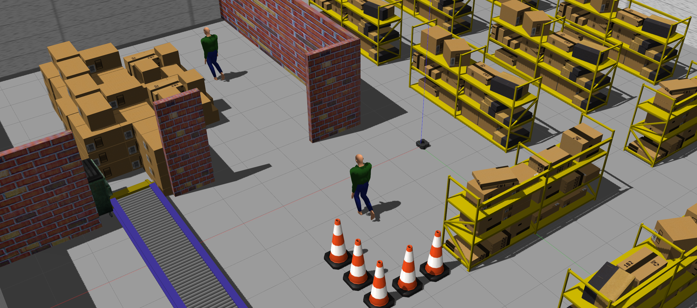

# Introduction

This is a Gazebo plugin for pedestians with collision property. You can construct a dynamic environment in ROS easily using plugin.


# Configure
To start simulation, compile using `catkin_make`. You can directly using this folder as workspace.
```bash
cd pedestrians_simulation/
catkin_make
```

Or, we assume that your workspace is `~/sim_platform/`.
```sh
cd ros_motion_planning/
mv src/ ~/sim_platform/
cd ~/sim_platform/
catkin_make
```

Edit pedestrians configure
```sh
cd src/config/
touch pedestrians_config.yaml
```

Below is the example of `pedestrians_config.yaml`

```yaml
world: test_scene
update_rate: 5

# sfm algorithm configure
social_force:
  animation_factor: 5.1
  # only handle pedestrians within `people_distance`
  people_distance: 6.0
  # weights of social force model
  goal_weight: 2.0
  obstacle_weight: 80.0
  social_weight: 15
  group_gaze_weight: 3.0
  group_coh_weight: 2.0
  group_rep_weight: 1.0

# pedestrians setting
pedestrians:
  ped_tracker:
    enable: true
    model: DROW3
    weight: ckpt_jrdb_ann_drow3_e40.pth
  ped_property:
    - name: human_1
      pose: 5 -2 1 0 0 1.57
      velocity: 0.9
      radius: 0.4
      cycle: true
      time_delay: 5
      ignore:
        model_1: ground_plane
        model_2: turtlebot3_waffle
      trajectory:
        goal_point_1: 5 -2 1 0 0 0
        goal_point_2: 5 2 1 0 0 0
    - name: human_2
      pose: 6 -3 1 0 0 0
      velocity: 1.2
      radius: 0.4
      cycle: true
      time_delay: 3
      ignore:
        model_1: ground_plane
        model_2: turtlebot3_waffle
      trajectory:
        goal_point_1: 6 -3 1 0 0 0
        goal_point_2: 6 4 1 0 0 0
```
Explanation:

- `world`: Gazebo world，located in `src/worlds/`.
- `update_rate`: Update rate of pedestrains presentation. The higher `update_rate`, the more sluggish the environment becomes.
- `social_force`: The weight factors that modify the navigation behavior. See the [Social Force Model](https://github.com/robotics-upo/lightsfm) for further information.
- `pedestrians/ped_tracker`: Pedestrians tracker thread. *NOTE: Need `Pytorch` environment!*
  - `enable`: Enable the tracker.
  - `model`: Select the detection model. *Optional: `DROW3` or `DR-SPAAM`*
  - `weight`: The weight file for the detection model respectively which located in `pedestrian_tracker/weight/..`.
- `pedestrians/ped_property`: Pedestrians property configuration.
  - `name`: The id for each human.
  - `pose`: The initial pose for each human.
  - `velocity`: Maximum velocity (*m/s*) for each human.
  - `radius`: Approximate radius of the human's body (m).
  - `cycle`: If *true*, the actor will start the goal point sequence when the last goal point is reached.
  - `time_delay`: This is time in seconds to wait before starting the human motion.
  - `ignore_obstacles`: All the models that must be ignored as obstacles, must be indicated here. The other actors in the world are included automatically.
  - `trajectory`. The list of goal points that the actor must reach must be indicated here. The goals will be post into social force model.


# Start

We provide a script to quickly start the world
```sh
cd ./pedestrian_simulation/scripts
./main.sh
```

# More

More examples could be found at [https://github.com/ai-winter/ros_motion_planning](https://github.com/ai-winter/ros_motion_planning).

# Acknowledgments
* Pedestrian tracker: [2D_lidar_person_detection](https://github.com/VisualComputingInstitute/2D_lidar_person_detection)
* Pedestrian RVIZ visualization: [spencer_tracking_rviz_plugin](https://github.com/srl-freiburg/spencer_tracking_rviz_plugin)